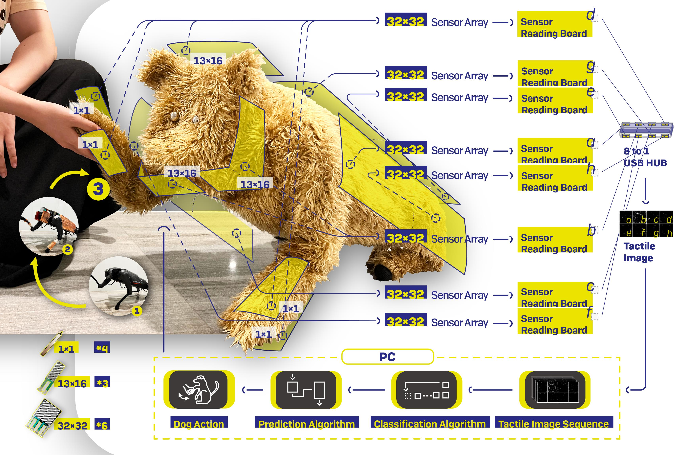

# 
Enable Natural Tactile Interaction for Robot Dog based on Large-format Distributed Flexible Pressure Sensors

Lishuang Zhan1, Yancheng Cao1, Qitai Chen1, Haole Guo1,
Jiasi Gao1, Yiyue Luo2, Shihui Guo3, Guyue Zhou1 and Jiangtao Gong1

1 Institute for AI Industry Research (AIR), Tsinghua University.

2 Computer Science and Artificial Intelligence Laboratory (CSAIL), Massachusetts Institute of Technology.

3 School of Informatics, Xiamen University.

Touch is an important channel for human-robot interaction, while it is challenging for robots to recognize human touch accurately and make appropriate responses.
In this paper, we design and implement a set of large-format distributed flexible pressure sensors on a robot dog to enable natural human-robot tactile interaction. 
Through a heuristic study, we sorted out 81 tactile gestures commonly used when humans interact with real dogs and 44 dog reactions. 
A gesture classification algorithm based on ResNet is proposed to recognize these 81 human gestures, and the classification accuracy reaches 98.7%. 
In addition, an action prediction algorithm based on Transformer is proposed to predict dog actions from human gestures, reaching a 1-gram BLEU score of 0.87. 
Finally, we compare the tactile interaction with the voice interaction during a freedom human-robot-dog interactive playing study. 
The results show that tactile interaction plays a more significant role in alleviating user anxiety, stimulating user excitement and improving the acceptability of robot dogs. 

This repo contains the supplementary materials of the paper, including **i) definitions of the 81 tactile gestures** and **ii) three self-rating scales of the compared experiment**.

### The definitions of the 81 tactile gestures.

### Three self-rating scales of the compared experiment.
###### The Attitude Scale

- Q1: I like robot dogs.
- Q2: I wish I had a robot dog in my house.
- Q3: Having a robot dog is a waste of money.
- Q4: A robot dog would make my life much happier if I had one in my house.
- Q5: I would sometimes feel sad if I saw a robot dog locked up.
- Q6: I would spend some time playing with my robot dog every day.
- Q7: The robot dog would provide the feedback I want.
- Q8: The world would be better if people could stop spending so much time playing with robot dogs and, instead, focus more on other people.
- Q9: I would love to see this robot dog performing all sorts of actions.
- Q10: It would be unethical if this type of robot dog were created purely for the sake of experimentation.
- Q11: I would let the robot dog sleep in my room.

###### The Emotion Self-Rating Scale

- Q1. I feel despirited and depressed.
- Q2. My heart beats faster than usual.
- Q3. I feel tired.
- Q4. My mind is as clear as it used to be.
- Q5. I find it easy to do what I did before.
- Q6. I am full of hope for the future.
- Q7. I feel useful and wanted.
- Q8. My life is fulfilling.
- Q9. I make decisions easily.
- Q10. I still enjoy the things I used to do.
- Q11. I feel more nervous and anxious than before.
- Q12. I feel everything is good, and nothing bad could happen.
- Q13. I feel angry and panicky.
- Q14. I feel like I am about to collapse.
- Q15. I feel weak.
- Q16. I feel calm and can sit still easily.
- Q17. My fingers and toes are numb and tingly.
- Q18. I feel morning is the best time.
- Q19. I feel scared for no reason.
- Q20. I can breathe in and out easily.

###### The Valence and Arousal Scale

